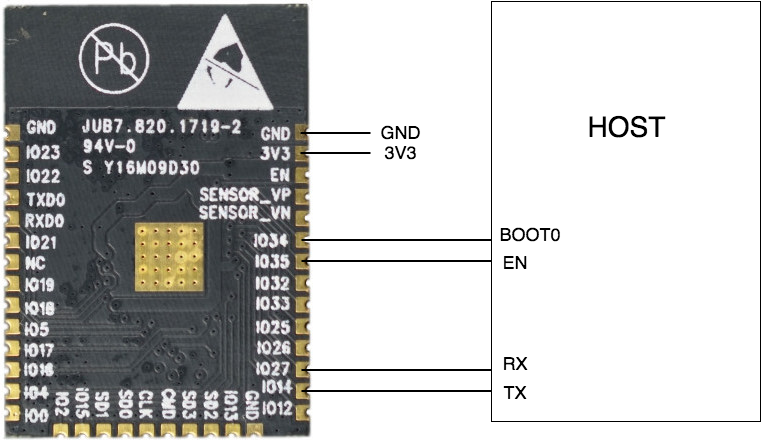
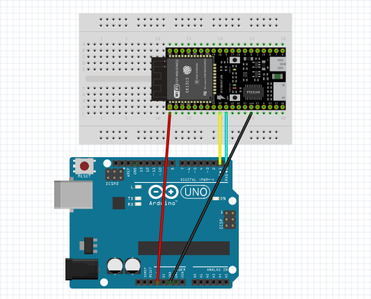

# CCM (Cloud Communication Module)

CCM module provides secure IoT connectivity for any microcontroller-based
product. Below is the summary of the provided functionality:

- Send MQTT messages to the cloud
- Subscribe to MQTT messages from the cloud
- Send HTTP/RESTful requests to the cloud
- Update device shadow / device twin (AWS, Azure, mDash)
- Receive device shadow / device twin updates (AWS, Azure, mDash)
- Provision CCM over the Bluetooth Low Energy (BLE)
- Provision CCM over the WiFi Access Point
- Provision CCM from the Host MCU
- Update Host MCU over-the-air. Implemented for STM32 or AVR Hosts
- Update CCM itself over-the-air

## Setting up hardware

There are two ways of getting a functioning CCM module:

1. Buy a ready-to-go, pre-flashed, encrypted module via the [order form](https://mongoose-os.com/order-ccm.html)
2. Use any ESP32 hardware you already have, and flash the CCM firmware on it yourself:
   * Install `mos` tool by following "Step 1" at [mos quickstart](https://mongoose-os.com/docs/quickstart/setup.md)
   * Run `mos flash ccm` command

## Wiring

Host microcontroller should be connected to the CCM via the UART's TX and RX
lines. That enables UART communication between two microcontrollers.
To enable Host firmware update, an RST (reset) line also
should be connected. That allows CCM to put Host into a boot loader mode
for the firmware update, and then use UART to transfer firmware data.

Table below summarises the pinout. Note that the pinout below is configurable,
see configuration section at the end of this document.

| CCM pin | Host MCU pin  |
| ------- | ------------  |
| GND     | -             |
| 3.3v    | -             |
| 25      | UART RX       |
| 26      | UART TX       |
| 27      | RST (reset)   |

<!--  -->

### Communication protocol

Host MCU communicates with CCM over the UART. The communication protocol
is JSON-RPCv2, where JSON-RPC frames are delimited by newline characters.
Per JSON-RPC standard, JSON frames with the `id` attribute require response,
whereas frames without the `id` attribute are notifications that do not
trigger any response.

For example, CCM sends a device shadow delta to the Host. This frame does
not have an `id` attribute, thus Host does not send a response:


```javascript
{"method": "Shadow.Delta", "params": {"on": true}}  // CCM -> Host
```

When Host receives a JSON-RPC frame, it must parse the frame and call
corresponding handler function. A handler function processes the request
and produces a reply, which is sent back to the CCM.
In the following communication example, a CCM calls a custom function `Sum` that
adds two numbers:

```javascript
{"id": 12007, "method": "Sum", "params": [2,3]}   // CCM -> Host
{"id": 12007, "result": 5}                        // Host -> CCM
```

And here is the example when CCM calls a non-existent function:

```javascript
{"id": 12008, "method": "This_Function_Does_Not_Exist", "params": true}   // CCM -> Host
{"id": 12008, "error": {"code": -32601, "message": "method not found"}}   // Host -> CCM
```

The communication is two-way. This is an example where Host
sends an MQTT message to the cloud:

```javascript
{"method": "MQTT.Pub", "params": {"topic": "t1", "message": "hello"}}   // Host -> CCM
```

### mjson JSON-RPC library

For the Host, a compact C/C++ JSON-RPC library called `mjson` is available.
`mjson` is a single-header, open source, MIT-licensed library located at
https://github.com/cesanta/mjson. `mjson` makes it
easy to define RPC services on the Host MCU, and call RPC services on CCM.

The `msjon` usage pattern is as follows:

1. Initialise the library by calling `jsonrpc_init()`
2. Export any number of custom functions using `jsonrpc_export()`
3. In the event loop, read the UART, feed each read byte into `json_process_byte()`
4. At any time, you can call `jsonrpc_call()` to send a JSON-RPC frame to the CCM

That pattern works on any Host MCU, regardless the architecture and
development environment: on Nordic nRF, TI, PIC, Atmel, STM32, NXP, or
what have you.

It is easy to demonstrate it on the Arduino platform.
The Arduino sketch below shows how to create a `Sum` RPC service for adding
two numbers:

```c
#include "mjson.h"  // Sketch -> Add file -> add mjson.h

// Gets called by the RPC engine to send a reply frame
static int sender(const char *frame, int frame_len, void *privdata) {
  return Serial.write(frame, frame_len);
}

// RPC handler for "Sum". Expect an array of two integers in "params"
static void sum(struct jsonrpc_request *r) {
  int a = mjson_get_number(r->params, r->params_len, "$[0]", 0);
  int b = mjson_get_number(r->params, r->params_len, "$[1]", 0);
  jsonrpc_return_success(r, "%d", a + b);
}

void setup() {
  jsonrpc_init(sender, NULL, NULL,  "1.0"); // Initialise the library
  jsonrpc_export("Sum", sum, NULL);         // Export "Sum" function
  Serial.begin(115200);                     // Setup serial port
}

void loop() {
  if (Serial.available() > 0) jsonrpc_process_byte(Serial.read());
}
```

When this sketch is compiled and flashed on an Arduino
board, start Arduino Serial Monitor, type
`{"id": 1, "method": "Sum", "params": [2,3]}` and hit enter. You should
see an answer frame:


### RPC Services provided by the CCM

#### Shadow.Report

Update device's `reported` state on the cloud.
Parameters: arbitraty JSON value - a string, number, array,
or an object of an arbitrary complexity.

Example: update shadow reported state on the cloud: set "reported.on" to true

```c
jsonrpc_call("{\"method\":\"Shadow.Report\",\"params\":{%Q:%s}}", "on", "true");
```

Corresponsing JSON-RPC frame generated by the above call (note the absence of the `id`):

```javascript
{"method": "Shadow.Report", "params": {"on": true}}
```

#### MQTT.Pub

Send MQTT message to the cloud.
Parameters: a JSON object `{"topic": xx, "message": xx, "qos": xx}`.
`topic` and `message` must be strings, and `qos` must be a number 0 or 1.

Update shadow reported state on the cloud: set "reported.on" to true:

```c
jsonrpc_call("{\"method\":\"MQTT.Pub\",\"params\":{%Q:%Q,%Q:%Q,%Q:%d}}",
             "topic", "t1", "message", "hello", "qos", 1);
```

Corresponsing JSON-RPC frame generated by the above call (note the absence of the `id`):

```javascript
{"method": "MQTT.Pub", "params": {"topic": "t1", "message": "hello", "qos": 1}}
```

### RPC Services provided by the Host

#### RPC.List

Return a list of all RPC services exported by the Host.
Parameters: none.

NOTE: This is a built-in service.

Serial communication example:

```javascript
{"id": 1, "method": "RPC.List"}                             // CCM -> Host
{"id":1,"result":["Shadow.Delta","RPC.List","Sys.Info"]}    // Host -> CCM
```

#### Sys.Info

Return information about the Host.  Parameters: none.

NOTE: This is a built-in service.

Serial communication example:

```javascript
{"id":1,"method": "Sys.Info"}                             // CCM -> Host
{"id":1,"result":{"fw_version":"1.0", "arch":"unknown", "fw_id":"Nov 24 2018 09:10:27", "app":"posix_device"}} // Host -> CCM
```

#### Shadow.Delta

React on the device shadow change. This is a notification service, meaning
that the handler function must not send any return value. Instead, it could send
a `Shadow.Report` notification to the cloud, informing the cloud about the
changed state.

NOTE: This service should be implemented by the user
if user wants the device to be shadow-controlled.

Parameters: arbitraty JSON value - a string, number, array,
or an object of an arbitrary complexity.

Example serial communication (note the absence of the `id`):

```javascript
{"method": "Shadow.Delta", "params": {"on": true}}                  // CCM -> Host
{"method": "Shadow.Report", "params": {"on": true, "uptime": 132}}  // Host -> CCM
```

### Provisioning CCM module

#### WiFi provisioning

##### WiFi provisioning via Access Point

When an unprovisioned CCM module boots up, it can open a WiFi Access Point.
It is possible to connect to the Access Point and use a RESTful service
to setup WiFi. An un-provisioned CCM is accessible at predefined IP
address `192.168.4.1`. Example WiFi setup:

1. Connect to a WiFi network `CCM-xxxxxx`
2. Run the following command (replace NAME and PASS with your WiFi name and password):

```
curl -d '{"config": {"wifi":{"sta":{"enable":true,"ssid":"NAME","pass":"PASS"}}}}' http://192.168.4.1/rpc
```

##### WiFi provisioning via Serial line

Using this method, a CCM module could be provisioned by the Host controller.
Call two RPC methods: `Config.Set` followed by the `Config.Save`:

Update CCM configuration - setup local WiFi network:

```c
jsonrpc_call("{\"method\":\"Config.Set\",\"params\":{\"config\":{\"wifi\":"
             "{\"sta\":{\"enable\":true,\"ssid\":%Q,\"pass\":%Q}}}}}",
             "NAME", "PASS");
jsonrpc_call("{\"method\":\"Config.Save\",\"params\":{\"reboot\":true}}");
```

Corresponsing JSON-RPC frame generated by the above call (note the absence of the `id`):

```javascript
{"id":1,"method":"Config.Set","params":{"config":{"wifi":{"ssid":{"enable":true,"ssid":"NAME","pass":"PASS"}}}}}
{"id":2,"method":"Config.Save","params":{"reboot":true}}
```

#### Cloud provisioning

1. Download `mos` tool by following Step 1 at https://mongoose-os.com/docs/quickstart/setup.md
2. Connect CCM to your workstation over a serial line

#### AWS IoT provisioning

```
mos aws-iot-setup --aws-iot-region AWS-REGION
```

#### Microsoft Azure provisioning

```
mos azure-iot-setup --azure-hub-name YOUR_AZURE_HUB_NAME
```

#### Google IoT Core provisioning

```
mos gcp-iot-setup --gcp-project YOUR_PROJECT_ID --gcp-region europe-west1 --gcp-registry iot-registry
```

#### IBM Watson provisioning

```
mos watson-iot-setup
```

### Factory reset

CCM provides a way to factory-reset the module. Factory reset clears WiFi
configuration, and opens an AP after boot for further WiFi provisioning.
Factory reset is triggered by the "long button press", i.e. setting the
factory reset GPIO pin low and holding it in the low state for some time,
defined by the timeout value.

See Configuration Reference section for the exact tunables.

### Security

CCM modules provide high level of security, employing several layers
of protection:

- Flash encryption. Reading flash returns garbage. An attempt to copy
  the flash to clone CCM devices won't work.
- TLS 1.2 communication. Connections to the cloud services are secured
  by the modern TLS 1.2 standard.
- Ability to lock the configuration. Device vendor can choose the level
  of control end-user has over CCM - for example, completely disable any
  changes to configuration. By default, a CCM is provisioned to the cloud
  by vendor, and provisioned to WiFi by end-user.

### Configuration reference

CCM configuration is a JSON document that is stored on CCM's flash and
could be managed by the following RPC functions:

- `Config.Get` - get configuration. Optional parameters: `{"key": "..."}`
  specifies the sub-tree to retrieve. If params is omitted, then the whole
  configuration tree is retrieved.
- `Config.Set` - set configuration. Parameters: `{"config": {...}}`
  specifies the sub-tree to change.
- `Config.Save` - saves configuration.

Below is a CCM configuration available for tuning:

```javascript
{
  "provision": {
    "btn": {
      "pin": 0,             // Factory reset pin
      "pull_up": true,      // Pull-up state
      "hold_ms": 0          // Number of milliseconds to hold for reset
    },
    "led": {
      "pin": -1,            // Status LED GPIO number
      "active_high": true   // LED is on when the voltage is high
    },
    "stable_state": 3,      // Do not reset when joined WiFi at least once
    "timeout": 300,
    "max_state": 3
  }
}
```

## CCM-EVAL evaluation board

The CCM-EVAL is an Espressif DevKit-C board with the CCM firmware loaded
on it. The board uses CCM-MOD module, thus it works exactly the same way
as CCM-MOD in a final design.

### Wiring

- Connect Host's RX to CCM pin 25
- Connect Host's TX to CCM pin 26
- Connect CCM pins GND and 3v3

Example of Arduino Uno wiring:



### Load Arduino sketch

Visit
https://github.com/cesanta/mjson/blob/master/example/shadow.ino
Arduino sketch example. It demonstrates how to implement LED on/off via
the device shadow. It works with any cloud that supports device shadow, for
example AWS IoT, Azure IoT, https://dash.mongoose-os.com.

See https://mongoose-os.com/ccm/ for video tutorial.
