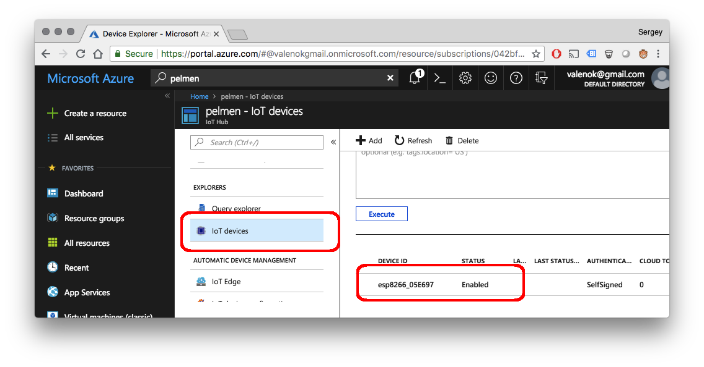
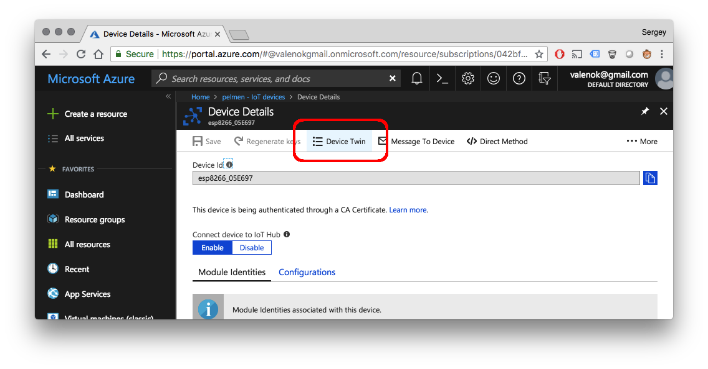
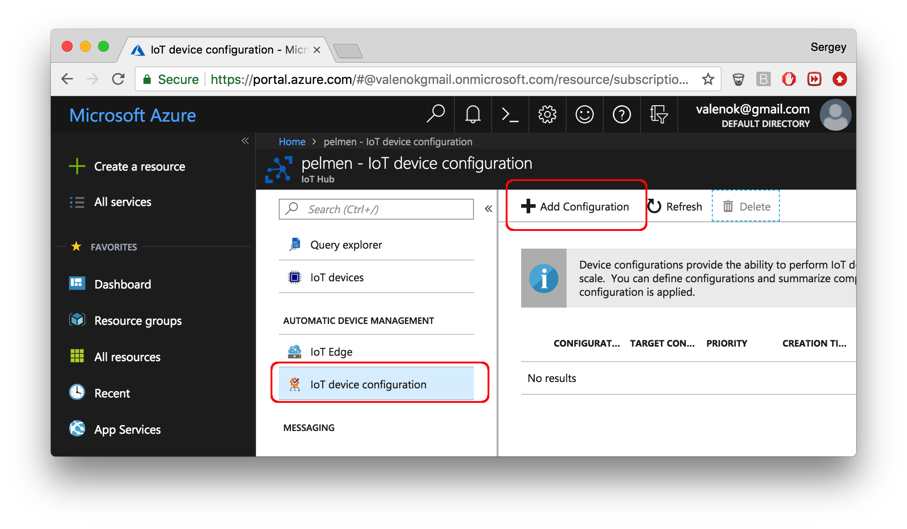

# Mongoose OS and Microsoft Azure IoT

This tutorial demonstrates the following:

- How to build a skeleton for a commercial smart device, managed using Microsoft Azure IoT
- How to reuse the code for different hardware platforms
- How to configure devices via Azure IoT Hub device twin
- How to perform bulk over-the-air (OTA) updates using [Azure IoT Hub automatic device management](https://docs.microsoft.com/en-us/azure/iot-hub/iot-hub-auto-device-config)


## Setup Azure IoT Hub

- Create an account on [portal.azure.com](http://portal.azure.com)
- Install `az`, the Azure command line utility, by [following these instructions](https://docs.microsoft.com/en-us/cli/azure/install-azure-cli?view=azure-cli-latest")
- Start command prompt (or terminal on UNIX/Mac), login and follow the instructions:
```
az login
```
- Create an IoT hub. Note:
   * Use EU-West region (this is important, since not all regions have IoT device configuration enabled)
   * Choose standard pricing tier


## Setup device

- Follow [mos tool setup instructions](/software.html) to install `mos` tool
- Pick one of the supported devices. We suggest to choose from [recommended devboards](../quickstart/devboards.md)
- Connect your device to your workstation via USB
- Clone, build and flash the firmware:
```bash
git clone https://github.com/mongoose-os-apps/demo-js
cd demo-js
mos build --platform YOUR_PLATFORM  # e.g. stm32, esp32, esp8266, cc3220
mos flash
```
NOTE: you can customise this firmware as you wish, or build a firmware
from scratch using an [empty](https://github.com/mongoose-os-apps/empty) app.
In this case, it is important to include
[azure](https://github.com/mongoose-os-libs/azure) library in the `libs` section
of the `mos.yml` file:
```yaml
libs:
  ...
  - origin: https://github.com/mongoose-os-libs/azure # <-- Add this!
```


- Configure WiFi on a device using the mongoose OS command line tool `mos`
```
mos wifi WIFI_NETWORK WIFI_PASSWORD
```

- Provision your device to Azure IoT with a single command using the `mos` tool:
```
mos azure-iot-setup --azure-hub-name YOUR_AZURE_HUB_NAME
```

A newly provisioned device will appear in the IoT hub's device list. On the
picture, an ESP8266 board was used. You will get a different device ID,
depending on the hardware platform you're using.



## Configuraing the device using Azure IoT Hub device twin

In the IoT Hub blade of the Azure portal, click on the device ID shown in the device list, then select the
"Device twin" tab:



That will bring up the device twin editor:


Start your favorite editor, create a file called `init.js`, copy-paste
the following snippet and save:

```javascript
load('api_config.js');
load('api_gpio.js');
load('api_shadow.js');

let led = Cfg.get('pins.led');  // Built-in LED GPIO number
let state = {on: false};        // Device state - LED on/off status

// Set up twin handler to synchronise device state with the shadow state
Twin.addHandler(function(event, obj) {
  if (event === 'CONNECTED') {
    // Connected to shadow - report our current state.
    Twin.update(0, state);
  } else if (event === 'UPDATE_DELTA') {
    // Got delta. Iterate over the delta keys, handle those we know about.
    print('Got delta:', JSON.stringify(obj));
    for (let key in obj) {
      if (key === 'on') {
        // Twin wants us to change local state - do it.
        state.on = obj.on;
        GPIO.set_mode(led, GPIO.MODE_OUTPUT);
        GPIO.write(led, state.on ? 1 : 0);
        print('LED on ->', state.on);
      } else {
        print('Dont know how to handle key', key);
      }
    }
    // Once we've done synchronising with the shadow, report our state.
    Twin.update(0, state);
  }
});
```

This snippet makes a device controllable by the device twin, by synchronising
the `on` attribute in the device twin with the LED status: if `on` is `true`,
the LED is turned on, and if `on` is `false`, it is turned off. That is done
by handling `Shadow.UPDATE_DELTA` event, which is generated every time
the `desired` attributes of the twin are different from the `reported` attributes.

In the command prompt (or terminal on Linux/Mac), enter the following commands
to copy `init.js` to the device, reboot the device, and start monitoring
serial output:

```
mos put init.js
mos call Sys.Reboot
mos console 
```

In the device twin editor, add `desired.on` boolean key:

```javascript
  ...
  "desired": {
    "on": true,   // <-- add this 
    ...
  },
  ...
```

Set it to `true` or
`false`, and observe how the device reacts by switching the LED on/off:

<video controls="" class="text-center border w-75 my-2">
    <source src="images/azure5.mp4" type="video/mp4">
</video>

This example demonstrates remote device configuration using the device twin, and can be
applied to a broad range of use cases.

## IoT button

Open `fs/init.js` file in your favorite editor, copy/paste the following code:

```javascript
load('api_config.js');
load('api_gpio.js');
load('api_sys.js');
load('api_mqtt.js');

let pin = Cfg.get('board.button1.pin');  // Built-in button GPIO number
let topic = '/devices/' + Cfg.get('device.id') + '/events';  // MQTT topic

let f = function() {
  let message = JSON.stringify({
    total_ram: Sys.total_ram(),
    free_ram: Sys.free_ram(),
    uptime: Sys.uptime(),
  });
  let ok = MQTT.pub(topic, message, 1);
  print('Published:', ok, topic, '->', message);
};

GPIO.set_button_handler(pin, GPIO.PULL_UP, GPIO.INT_EDGE_NEG, 20, f, null);
```

When done, copy `fs/init.js` to the device and reboot the device:

```
mos put fs/init.js
mos call Sys.Reboot
```

Then, press a button to send an MQTT message.

## Bulk OTA updates with the Azure IoT Hub automatic device management feature

Register a couple more devices in the Azure IoT Hub, following the same steps as in the Setup Device section above:

```
mos azure-iot-setup --azure-hub-name YOUR_AZURE_HUB_NAME
```

For each device, edit the Device Twin adding the following snippet:

```
"tags": {
  "city": "dublin"
},
```

Make some change in the firmware code. Replace the code in `fs/init.js` with
`print('hello new version');` and rebuild the firmware:

```
mos build --platform YOUR_PLATFORM
mos console
```

This will generate a new firmware `build/fw.zip`. Upload this file to some
web server of your choice.

In the Azure IoT Hub blade go to the Automatic Device management section and create a new device configuration:




Give this configuration a name. On step 2, specify twin settings you'd like
to apply: "Device Twin Path" set to `properties.desired`, and "Content" to

```json
{
  "ota": {
    "url": "URL_OF_THE_REBUILT_fw.zip"
  }
}
```
Skip Step 3, and on Step 4 specify "Target Condition":
`tags.city='dublin'`. Submit configuration.

Open the device twin of any device, make sure that the
`desired.properties.ota.url` attribute has been applied. The firmware we've
built uses the [ota-shadow](https://github.com/mongoose-os-libs/ota-shadow)
library which observes that attribute in the twin, and starts an OTA update
if it is changes.

The OTA parameters are reported by the firmware in the `properties.reported.ota`,
where you can see various metrics:

```json
  "reported": {
    "ota": {
      "fw_version": "1.0",
      "fw_id": "20180716-150324/lsm@23146fe+",
      "mac": "5ECF7F060046",
      "device_id": "esp8266_060046",
      "app": "demo-js",
      "message": "progress",
      "status": 1,
      "is_committed": true,
      "commit_timeout": 600,
      "partition": 0,
      "progress_percent": 27,
      ...
  },
```

Note the `progress_percent` value. If you refresh the twin editor, it'll change
to indicate the OTA update progress. When the update is complete, the value of
`ota.fw_id` changes to indicate the new timestamp of the firmware.
Observe console statement, note the `hello new version` message.

You have just performed an over-the-air firmware update accross multiple devices seamlesly leveraging Azure IoT.
