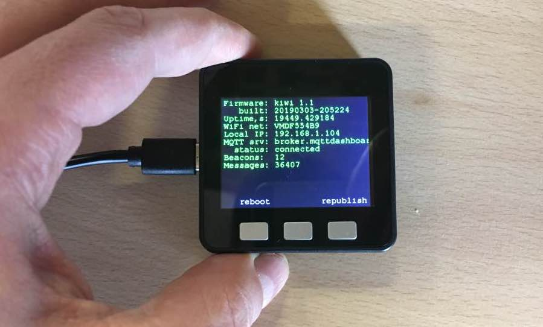
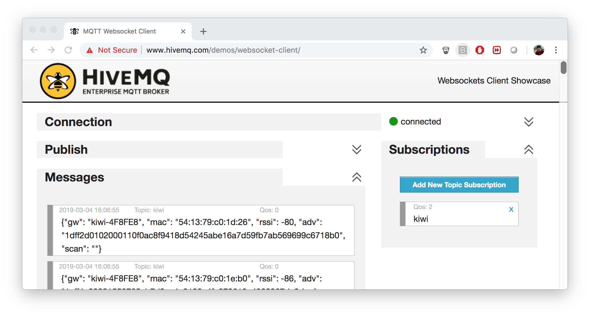

# KIWI - a bluetooth beacon gateway

## Introduction

KIWI module listens for the BLE beacon advertisements, and forwards them to
the specified MQTT server. AWS IoT, Azure, Google IoT Core, IBM Watson,
and private MQTT servers are supported. The gateway algorithm is as follows:

- Connect to the configured MQTT server. Reconnect when a connection is lost
- Perform a continuous BLE scan, listen for the BLE advertisements
- When a BLE advertisement is received,
  report it to the `kiwi.pub_topic` MQTT topic
- If the next advertisement is the same as previous, skip reporting
- Limit the frequency of reports by `kiwi.report_interval_ms` value
- When KIWI reconnects to a server, re-report all devices
- Subscribe to a `kiwi.sub_topic`. When any message arrives on this topic, re-report all devices
- This is an example message that gets reported to the MQTT:

```javascript
{
  "gw": "esp32-ce12ba",         // Gateway name
  "mac": "7f:d3:87:0b:ac:d5",   // Beacon's MAC address
  "rssi": -16,                  // Signal strength. Can be used for triangulation
  "adv": "02011a14ff4c3e54",    // Beacon advertisement data
  "scan": "04ae45c2"            // Scan response. Only available for active scans
}
```

## Quick start

1. Buy an ESP32 device mentioned on the [KIWI page](/kiwi/)
2. Connect an ESP32 device to your workstation via USB
3. Follow steps 1,2,3 of [mos setup](https://mongoose-os.com/docs/mongoose-os/quickstart/setup.md)
4. In the `mos` UI, run
  ```
  mos flash https://mongoose-os.com/downloads/kiwi/kiwi.zip
  ```
5. Follow step 7 of [mos setup](https://mongoose-os.com/docs/mongoose-os/quickstart/setup.md)
6. Login to the [license manager](https://license.mongoose-os.com) and buy KIWI licenses (one per device)
7. Execute `mos license`
8. Configure MQTT:
   - For generic/private MQTT server, run
   ```
   mos config-set mqtt.enable=true mqtt.server=HOST:PORT
   ```
   - For AWS, follow [AWS guide's](/docs/mongoose-os/cloud/aws.md) "Setup AWS IoT" and "Setup device" chapters
   - For Google, follow [GCP guide's](/docs/mongoose-os/cloud/google.md) "Setup Google IoT Core" and "Setup device" chapters
   - For Azure, follow [Azure guide's](/docs/mongoose-os/cloud/azure.md) "Setup Azure IoT Hub" and "Setup device" chapters
   - For Watson, follow [Watson guide's](/docs/mongoose-os/cloud/watson.md) "Quick setup" chapter
   - For [mDash](https://dash.mongoose-os.com), follow step 8 of [mos setup](https://mongoose-os.com/docs/mongoose-os/quickstart/setup.md)

When done, you should have your ESP32 device flashed, provisioned to WiFi,
connected to the cloud, and reporting devices. Below is an example
of M5Stack gateway,



reporting data to the http://www.mqtt-dashboard.com:




## Configuring KIWI

KIWI keeps its configuration on a flash filesystem. It could be instected
and changed using `mos` tool. To see an existing configuration,
execute `mos config-get`. Below is the documentation for relevant entries:

```javascript
"kiwi": {
  "pub_topic": "kiwi",        // Publish topic - devices get reported to it
  "sub_topic": "kiwi_flush",  // Subscribe topic - on message, devices are re-reported
  "qos":  0,                  // Publish QOS
  "report_interval_ms":  0,   // Reporting interval in milliseconds
  "active_scan":  false,      // Do an active or passive BLE scan
  "name_filter":  "",         // Only report devices with this substring in the name
},
"mqtt": {
  "enable": true,                               // Enable MQTT. Requires a license
  "server": "broker.mqttdashboard.com:1883",    // MQTT server address
}
```

In order to change any configuration parameter, execute `mos config-set name=value`, for example:

```
mos config-set mqtt.server=my.server.com:1883
mos config-set kiwi.pub_topic=my_cool_topic
```


## Rewriting scan responses

It is possible to define a custom logic to modify received scan results
before storing/reporting them. This can be done by uploading an `app.js`
file to the device:

```
mos put path/to/app.js
```

Here is how `app.js` content should look like:

```javascript
load('api_events.js');

let evo = ffi('void *get_kiwi_ev_descr(void)')();
let mkrsp = ffi('void kiwi_mkrsp(void *, char *, int)');  
let mkadv = ffi('void kiwi_mkadv(void *, char *, int)');

Event.on(Event.baseNumber('KWI'), function(ev, data) {
  let obj = s2o(data, evo);
  print('got kiwi event:', JSON.stringify(obj));

  // Put your response rewrite logic below.
  if (obj.stored_rsp !== '') {
    mkrsp(data, '\x01\x02\x03', 3);   // Rewrite scan resp
    mkadv(data, 'abc321', 6);         // Rewrite adv data
  }
}, null);

print('JS rewrite initialised');
```

For each scan result, a JavaScript callback function is called.
It receives scan `data` opaque pointer, which could be transformed into the
JavaScript object `obj` with the following fields:

```javascript
{
  "addr": "...",          // 6-byte device MAC address
  "adv": "...",           // Adv data
  "stored_adv": "...",    // Stored adv data
  "rsp": "...",           // Scan response
  "stored_rsp": "..."     // Stored scan response
}
```

All fields a byte strings. Length could be taken like `obj.adv.length`.
Contents could be examined using `at()` function, like `obj.adv.at(0)`.
See https://github.com/cesanta/mjs#built-in-api for mjs API reference.

For example, to traverse an adv data, do:

```javascript
    for (let i = 0; i < obj.adv.length; i++) {
       let val = obj.adv.at(i);
       print('Value at index', i, 'is', val);
    }
```


Functions `mkrsp()` and `mkadv` could be used to rewrite response and adv
data, respectively. They both take an opaque pointer, and string + length
parameter.

If you need to disable rewrite, just remove the `app.js`:
```
mos rm app.js
```

The device needs to be rebooted after `app.js` change, since `app.js` is
read once at startup.
