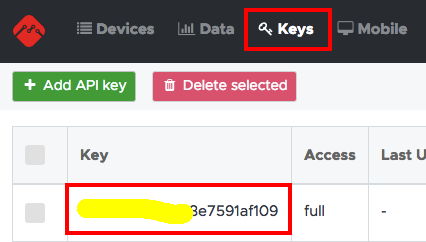

# Notifications

The dashboard provides a special secure Websocket endpoint
`wss://dash.mongoose-os.com/api/v2/notify`. This is a read-only notifications endpoint.
Each notification is a JSON object with three keys:

- `name`: notification name, e.g. "online", "offline", "rpc.in.GetInfo", "rpc.out.Log"
- `id`: an ID of a device that generated the event
- `data`: optional notification-specific data.

The `online` and `offline` events are generated by the dashboard. The
`rpc.out.*` events are generated by the device: these are JSON-RPC requests
without an ID (notifications). For example, `dash` library forwards all
device logs to the dashboard as `Log` RPC calls, thus generating `rpc.out.Log` events.
RPC call to the device generate `rpc.in.*` events.

The dashboard UI uses `/api/v2/notify` endpoint in order to catch state changes.
Login to the dashboard and open the developer tools / network / WS panel to
see it in action.

## How to catch notifications from all devices

You can implement your own service that attaches to the `/api/v2/notify`,
for example in Node JS (don't forget to substitute API_TOKEN with your real
API access token):

```javascript
const Websocket = require('ws');
const addr = 'wss://dash.mongoose-os.com/api/v2/notify?access_token=API_TOKEN';
const ws = new Websocket(addr, { origin: addr });
ws.on('message', msg => console.log('Got message:', msg.toString()));
```

To see your mDash API tokens, login to mDash and click on "Keys" tab:



## How to send a notification from your device

The API is documented at [mDash API](/docs/mos/api/cloud/dash.md).
Below are quick examples.

In C/C++:

```c
mgos_dash_notifyf("MyStat", "{temperature: %f}", 12.34);
```

In JavaScript:

```javascript
Dash.notify('MyStat', {temperature: 12.34});
```

Note that the format of data is arbitrary - it could be anything: a number,
a string, an array, or a complex nested object. It's up to you. In this
example, a simple object `{"temperature": 12.34}` is used. The
example  generates the following notification:

```javascript
{
  "id": "DEVICE_ID",        // This is the device ID that generated notification
  "name": "rpc.out.MyStat", // "rpc.out.EVENT_NAME", in our case rpc.out.MyStat
  "data": {"temperature": 12.34}  // Your event payload - arbitrary
}
```

Further possible actions:
- Catch this notification (see section above) and do your custom action
- Modify the PWA mobile app, which catches all notifications,
  and show the data somehow to the user
- Save the data automatically to the database, and graph it. See
  [Data Storage](data.md) section

