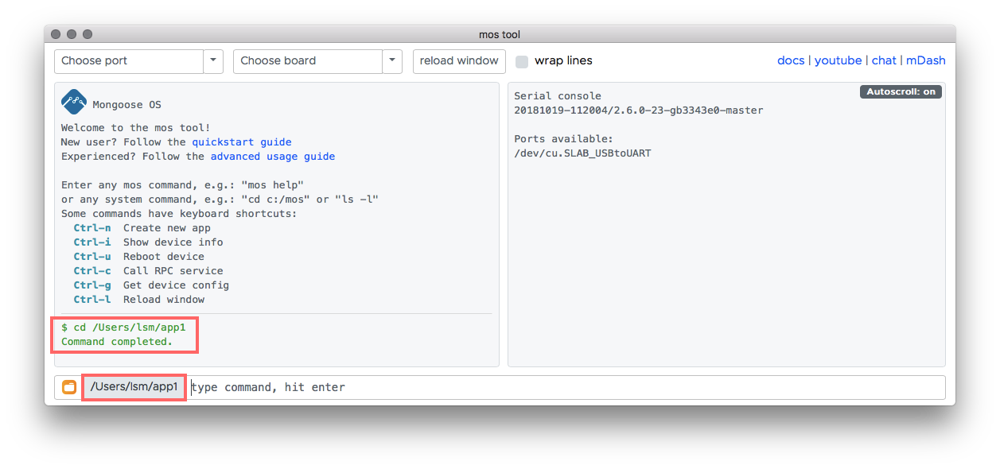
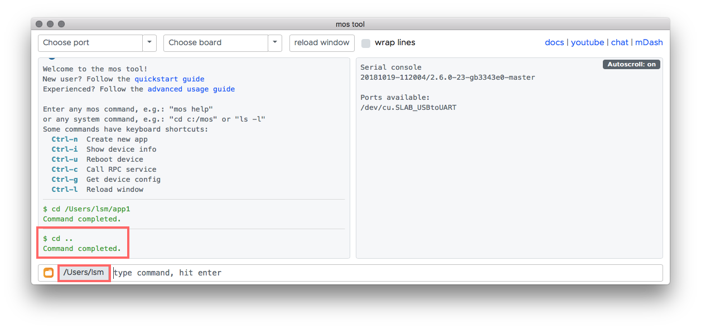
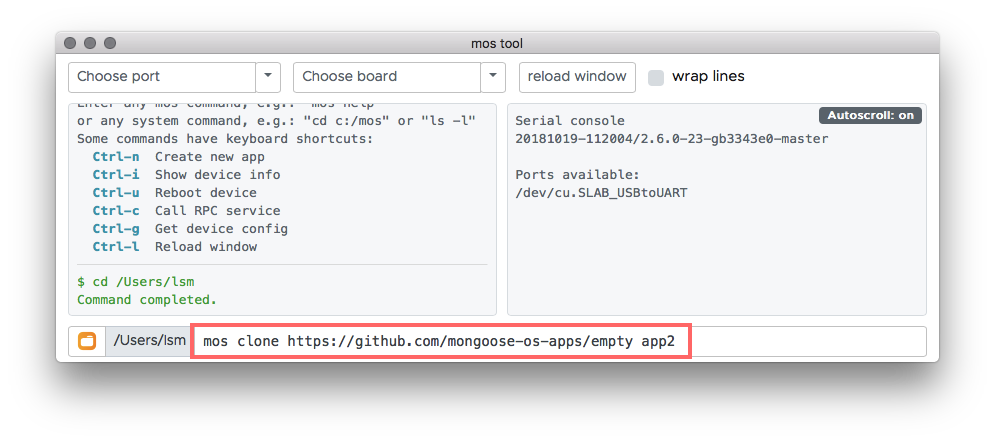
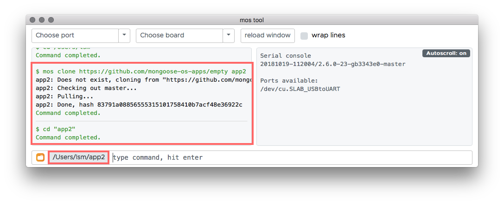
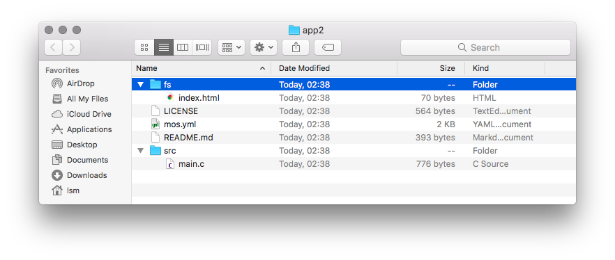
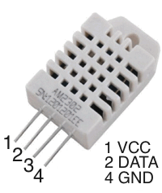
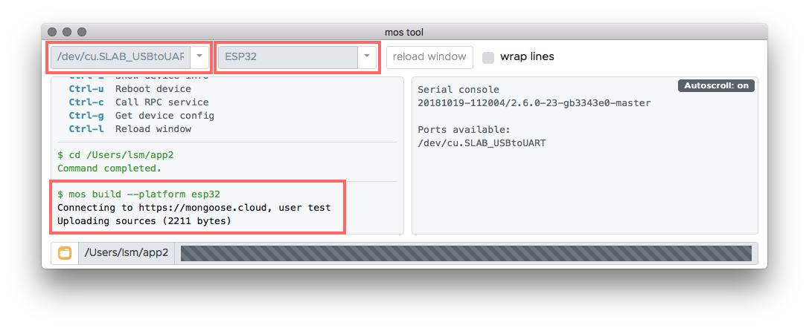

# Advanced guide: C/C++

In this guide we will learn how to implement device logic in C/C++.
In particular, our firmware will:
- have an ability to read DHT22 temperature/humidity sensor data
- set up a timer to read and print sensor data to the debug console
- implement a RPC service for reading the sensor remotely - for example,
  via MQTT

<div class="row">
  <div class="col-md-4">
    <div><a href="#start-mos-tool">1. Start mos tool</a></div>
    <div><a href="#clone-template-project">2. Clone template project</a></div>
    <div><a href="#learn-app-directory-structure">3. Learn app dir structure</a></div>
  </div>
  <div class="col-md-4">
    <div><a href="#add-necessary-libraries">4. Add required libraries</a></div>
    <div><a href="#create-custom-configuration-section">5. Create app's custom config</a></div>
    <div><a href="#add-code-that-uses-sensor-library">6. Add sensor code</a></div>
  </div>
  <div class="col-md-4">
    <div><a href="#build-the-app-and-test-sensor-reading">7. Build app, test sensor</a></div>
    <div><a href="#add-rpc-service-to-read-sensor-data-remotely">8. Add RPC service</a></div>
    <div><a href="#build-and-test-the-final-app">9. Rebuild app and test RPC</a></div>
  </div>
</div>

## Start `mos` tool

Run `mos` tool without arguments to start the Web UI. After start,
the Web UI changes current working directory to the directory where
it finishes the last time. In other words, it "remembers" its settings:
the working directory, chosen port, board, etc.
In this example, it is an `app1` directory, a quickstart example I have done recently:



Since we are going to create our new app in a different directory,
use the `cd DIRECTORY` command to change the current directory.
I am going to do `cd ..` to go up one level. Notice the current directory change:



## Clone template project

Now we are going to use a `mos clone URL DIRECTORY` command, in order to clone
some remote app into a DIRECTORY. Press `Ctrl-n` - that populates the input field
with `mos clone https://github.com/mongoose-os-apps/demo-js app1` . We don't
want to use `demo-js` as a template, so change it to `empty` to use a minimal
app, and change `app1` to `app2`:



Now press Enter to execute the command. Notice that the mos tool automatically
changes enters into the cloned directory:



## Learn app directory structure

Click on the folder icon on the bottom left corner to open a system
file browser in the current directory:



Here is the meaning of all files:

```
  fs/             -- All files we put here, will end up on device's filesystem
  └─ index.html   -- Device's HTTP server, if enabled, will serve this file
  LICENSE
  mos.yml         -- Describes how to build an app
  README.md       -- Document your app in this file
  src/
  └─ main.c       -- Contains device logic. We are going to edit this file
```

## Add necessary libraries

Open `mos.yml` file in your favorite editor and add support for DHT sensor:

```yaml
libs:
  - origin: https://github.com/mongoose-os-libs/rpc-service-config
  - origin: https://github.com/mongoose-os-libs/rpc-service-fs
  - origin: https://github.com/mongoose-os-libs/rpc-uart
  - origin: https://github.com/mongoose-os-libs/wifi
  - origin: https://github.com/mongoose-os-libs/dht  # <-- Add this line!
```

Note - all available libraries are collected under the https://github.com/mongoose-os-libs organisation. They are categorised
and documented under the "API Reference" docs section.
Now, open `src/main.c`, you'll see the following
skeleton code which initialises an app that does nothing:

```c
#include "mgos.h"

enum mgos_app_init_result mgos_app_init(void) {
  return MGOS_APP_INIT_SUCCESS;
}
```

## Create custom configuration section

Let's add a code that reads from a DHT temperature sensor every second.
The pin to which a sensor is attached, we make configurable by editing
a `config_schema:` section in the `mos.yml`, to have it like this:

```yaml
config_schema:
 - ["app", "o", {title: "My app custom settings"}]
 - ["app.pin", "i", 5, {title: "GPIO pin a sensor is attached to"}]
```

This custom configuration section will allow us to change sensor pin
at run time, without recompiling firmware. That could be done programmatically
or via the `mos` tool, e.g. `mos config-set app.pin=42`.

## Add code that uses sensor library

Then, edit `src/main.c`, add a timer (see [timer api docs](/docs/api/core/mgos_timers.h.md)) that reads DHT and logs the value
(error handling is intentionally omitted):

```c
#include "mgos.h"
#include "mgos_dht.h"

static void timer_cb(void *dht) {
  LOG(LL_INFO, ("Temperature: %lf", mgos_dht_get_temp(dht)));
}

enum mgos_app_init_result mgos_app_init(void) {
  struct mgos_dht *dht = mgos_dht_create(mgos_sys_config_get_app_pin(), DHT22);
  mgos_set_timer(1000, true, timer_cb, dht);
  return MGOS_APP_INIT_SUCCESS;
}
```

The `mgos_dht.h` file comes from the `dht` library that we have included to our app.
In order to find out its documentation and API, navigate to
"API Reference" -> "Drivers" -> "DHT temp sensor". This should bring you to
[this page - DHT temp sensor](/docs/api/drivers/dht.md). Similarly, you can find
out about any other library.

## Build the app and test sensor reading

Connect DHT sensor to pin 5. The sensor itself has following pins:



This is an example with ESP8266 NodeMCU. Red connector is VCC 3.3 volts, black
connector is ground GND, and yellow is data, connected to pin 5:


Build, flash the firmware, and attach the
console to see device logs. Assume we're working with ESP8266:

Choose your board and port in the the UI, and run `mos build` command:



When finished, run `mos flash` to flash the firmware and see the output in the console.

## Add RPC service to read sensor data remotely

Now let's use the cornerstone of Mongoose OS remote management capabilities.
We can make any hardware function be remotely accessible. This is done
by creating an RPC service. Read more about it in the Overview and Core
libraries sections, and here we jump straight to it. Looking at
[MG-RPC API doc](../api/rpc/rpc-common.md), add RPC service `Temp.Read`:

```c
#include "mgos.h"
#include "mgos_dht.h"
#include "mgos_rpc.h"

static void timer_cb(void *dht) {
  LOG(LL_INFO, ("Temperature: %lf", mgos_dht_get_temp(dht)));
}

static void rpc_cb(struct mg_rpc_request_info *ri, void *cb_arg,
                   struct mg_rpc_frame_info *fi, struct mg_str args) {
  mg_rpc_send_responsef(ri, "{value: %lf}", mgos_dht_get_temp(cb_arg));
  (void) fi;
  (void) args;
}

enum mgos_app_init_result mgos_app_init(void) {
  struct mgos_dht *dht = mgos_dht_create(mgos_sys_config_get_app_pin(), DHT22);
  mgos_set_timer(1000, true, timer_cb, dht);
  mg_rpc_add_handler(mgos_rpc_get_global(), "Temp.Read", "", rpc_cb, dht);
  return MGOS_APP_INIT_SUCCESS;
}
```

## Build and test the final app

Run `mos build` followed by `mos flash`.
And now, call the device's RPC service by running `mos call Temp.Read`.
You will see `{"value": 18.6}` printed.

This call could be performed over the serial connection as well as over
network connection - see [RPC section](/docs/userguide/rpc.md) to learn more.

