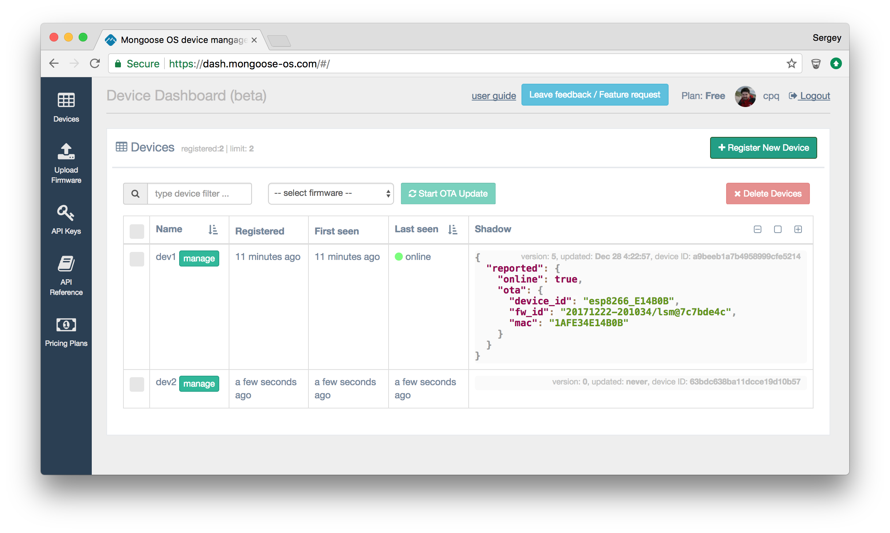
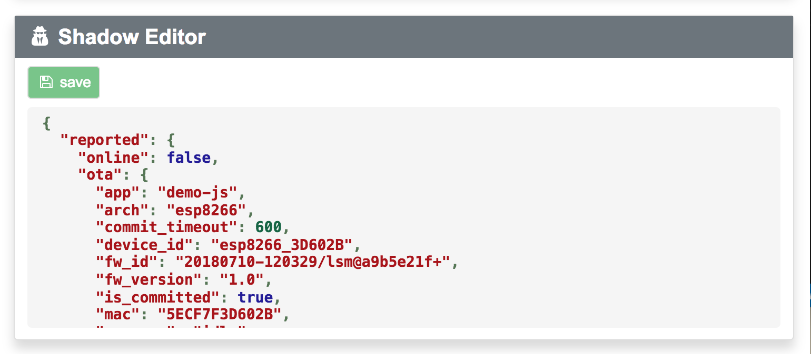

# Device Management Dashboard

<video controls="" class="float-right border w-50 ml-3 mb-3">
    <source src="images/dash1.mp4" type="video/mp4">
</video>

Mongoose OS provides an integrated service for device management called mDash.
It is located at https://dash.mongoose-os.com/ , and provides the following
functionality:

- 24/7 access and monitoring for your devices in the field
- Full isolation. Other users cannot see traffic from your devices and cannot
  access them
- RESTful API and Web UI that provide:
   * Online/offline status together with device metadata like
   firmware version, build time, device architecture
   * Full access to the devices' RPC services (remote management)
   * Reliable OTA updates with manual or automatic commit
   * Device twin (or, shadow) cloud object, semantically identical to AWS / Azure
- Notification stream that lets you catch state changes, implement custom logging, etc
- Notification logs stored persistently
- A Web UI for device management: filesystem, shadow object, OTA,
  device configuration, direct RPC calls

<!-- This is how it looks like: -->

<!--  -->

## How to add your device to the dashboard

**Step 1.** Make sure that your app has a library `dash` listed
in the `mos.yml` file. If you're using a pre-built `demo-js` Mongoose OS app,
you can omit this step. Otherwise, edit `mos.yml`:

```yaml
libs:
  ...
  - origin: https://github.com/mongoose-os-libs/dash  # <-- Add this line!
```

Then, `mos build` and `mos flash`.

**Step 2.** Congifure WiFi: `mos wifi NETWORK_NAME NETWORK_PASSWORD`

**Step 3.** Login to the https://dash.mongoose-os.com/, register a new device.
Click on a new device name, and copy the generated access token.

**Step 4.** Configure device: `mos config-set dash.enable=true dash.token=GENERATED_TOKEN`

Done! Now your device should appear "green" (online) on a dashboard.


## Technical overview

A configured device connects to the dashboard over the secure Websocket,
sending a `Authorization: Bearer GENERATED_TOKEN` handshake header.
After the successful handshake, all communication is done via the
JSON-RPC 2.0 protocol. Each RPC frame wrapped into the Websocket frame.

The RESTful API endpoints that the dashboard exports start with
`/api/v2/`. The endpoints that for the individual device start with
`/api/v2/devices/:id`, where `:id` is the unique device ID, generated at
the device registration together with the access token. Note: you cannot
provide your own token, but you can provide your own ID.

The dashboard gives a RESTful access to all RPC services exported by the device.
Thus, the dashboard acts as a JSON-RPC / RESTful bridge. The device's
RPC methods are mapped to `/api/v2/devices/:id/rpc/:method`  endpoints.
If the RPC endpoint does not accept any parameters, you cat use `GET` HTTP
method. If it does, `POST` must be used. The parameters should be a JSON
string, and the `Content-Type: application/json` header must be set, e.g.:

```
curl \
  -H 'Content-Type: application/json' \
  -H 'Authorization: Bearer API_KEY' \
  -d '{"pin": 2}' \
  http://dash.mongoose-os.com/api/v2/devices/DEVICE_ID/rpc/GPIO.Toggle
```

When a device comes online, the `dash` library that is responsible for the
dashboard connection, sends a shadow update message with the information
about the device: architecture, firmware version, etc.

### Over-the-Air firmware updates

<video controls="" class="float-right border w-50 ml-3 mb-3">
    <source src="images/dash2.mp4" type="video/mp4">
</video>

If a device includes `rpc-service-ota` library, then it can be updated remotely.
The three RPC functions that perform the OTA are `OTA.Begin`, `OTA.Write` and
`OTA.End`.

mDash provides a convenience RESTful handler for the OTA, where you can
just `POST` the new firmware .zip file, and mDash will call `OTA.Begin`
followed by a sequence of `OTA.Write` calls, finished by `OTA.End`.

The OTA can be performed either via the Web UI, or programmatically
using the REST API:

<pre class="command-line language-bash" data-user="chris" data-host="localhost" data-output="2-4"><code>curl -H 'Content-Type: application/json' \
  -H 'Authorization: Bearer API_KEY' \
  -v -F file=@fw.zip
  http://dash.mongoose-os.com/api/v2/devices/DEVICE_ID/ota
true</code></pre>

Once the firmware is updated, the device reboots in the "dirty", uncommitted
state. An `OTA.Commit` call must be done to bless the new firmware, otherwise
it will rollback, thinking that the health check did not pass. You can
call `OTA.Commit` as any other RPC method. mDash provides a handy
commit button for the convenience, when it sees an uncommitted device.


### Device shadow

Dashboard implements device shadow mechanism, semantically identical to
to the Azure device twin and Amazon IoT device shadow. Google IoT Core
state/config objects provide similar functionality, but implemented quite differently.

Device shadow is a JSON object that is associated with a device. It
lives on a cloud, keeps device state, and always available
regardless whether the associated device is online or offline. Shadow object
has three top-level keys:
 
 - `desired` - this is the state you want your device to have.
 - `reported` - this is the state your device actually has.
 - `delta` - automatically generated by the cloud
  every time `desired` or `reported` changes.
  `delta` is the difference between `desired` and `reported`
  **only for keys that are present in** `desired`.

The structure of the `desired` and `reported` subobjects is arbitrary -
create whatever structure you wish. However, the `dash` library that connects
your device to the dashboard, reserves some keys:
 
 - `reported.ota` - object that keeps firmware information and last OTA status
 - `reported.stats` - object that keeps device RAM statistics

The device shadow is displayed in the device list, and it is available for
edit in the device panel (when clicked on the device name):

<!--  -->

Devices can update their shadow using C API or JavaScript API,
see [shadow library](https://github.com/mongoose-os-libs/shadow) for reference.

In order to create new keys, send a shadow update with that new key and its
value. In order to delete a key, send a shadow update where that key is set
to `null`.

The best practive for using shadow on the device side is this:

- Catch the `MGOS_SHADOW_CONNECTED` event that indicates that the
  device is connected to its shadow, and report device current state to the
  `reported` key.
- Catch `MGOS_SHADOW_UPDATE_DELTA` event, and apply all keys in the `delta`
  to the device. If the state is changed,
  report and update to the `reported` key.

Example: see [example-shadow-js](https://github.com/mongoose-os-apps/example-shadow-js) app.


### Notifications

The dashboard provides a special secure Websocket endpoint
`wss://dash.mongoose-os.com/api/v2/notify`. This is a read-only notifications endpoint.
Each notification is a JSON object with three keys:

- `name`: notification name, e.g. "online", "offline", "rpc.in.GetInfo", "rpc.out.Log"
- `id`: an ID of a device that generated the event
- `data`: optional notification-specific data.

The `online` and `offline` events are generated by the dashboard. The
`rpc.out.*` events are generated by the device: these are JSON-RPC requests
without an ID (notifications). For example, `dash` library forwards all
device logs to the dashboard as `Log` RPC calls, thus generating `rpc.out.Log` events.
RPC call to the device generate `rpc.in.*` events.

The dashboard UI uses `/api/v2/notify` endpoint in order to catch state changes.
Login to the dashboard and open the developer tools / network / WS panel to
see it in action.

You can implement your own service that attaches to the `/api/v2/notify`,
for example in Node JS:

```javascript
const Websocket = require('ws');
const addr = 'wss://dash.mongoose-os.com/api/v2/notify';
const headers = { Authorization : 'Bearer ' + API_TOKEN };
const ws = new Websocket(addr, { origin: addr, headers: headers });
ws.on('message', msg => console.log('Got message:', msg.toString()));
```

<!--  -->

## REST API Reference

| Method | Endpoint         | Params | Description |
| ------ | ---------------- | ------ | ----------- |
| GET    | /devices         | &nbsp; | List all registered devices |
| POST   | /devices         | {"name": "x", "id": "y"} | Register new device. `id` is optional |
| PUT    | /devices/:id     | {"name": "x"} | Change device name |
| DELETE | /devices/:id     | &nbsp; | Delete device |
| POST   | /devices/:id/rpc/:func | {...} | Call device's RPC function |
| POST   | /devices/:id/ota | fw.zip | OTA: `curl -v -F file=@fw.zip URL` |
| GET    | /devices/:id/shadow | &nbsp; | Get device shadow |
| POST   | /devices/:id/shadow | {...} | Update device shadow |
| GET    | /keys            | &nbsp; | List all API keys |
| POST   | /keys            | &nbsp; | Create an API key |
| DELETE | /keys/:id        | &nbsp; | Delete an API key |
| GET    | /logs            | &nbsp; | Get stored notification logs |

Example:

<pre class="command-line language-bash" data-user="chris" data-host="localhost" data-output="2-4"><code>curl -H 'Content-Type: application/json' \
  -H 'Authorization: Bearer API_KEY' \
  -d '{"pin": 2}' \
  http://dash.mongoose-os.com/api/v2/devices/DEVICE_ID/rpc/GPIO.Toggle
true</code></pre>
