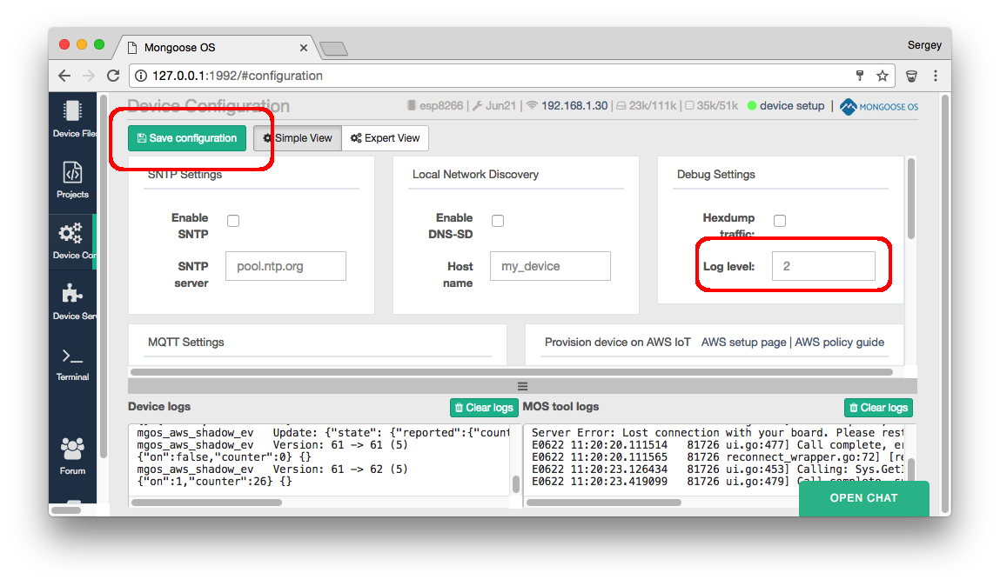
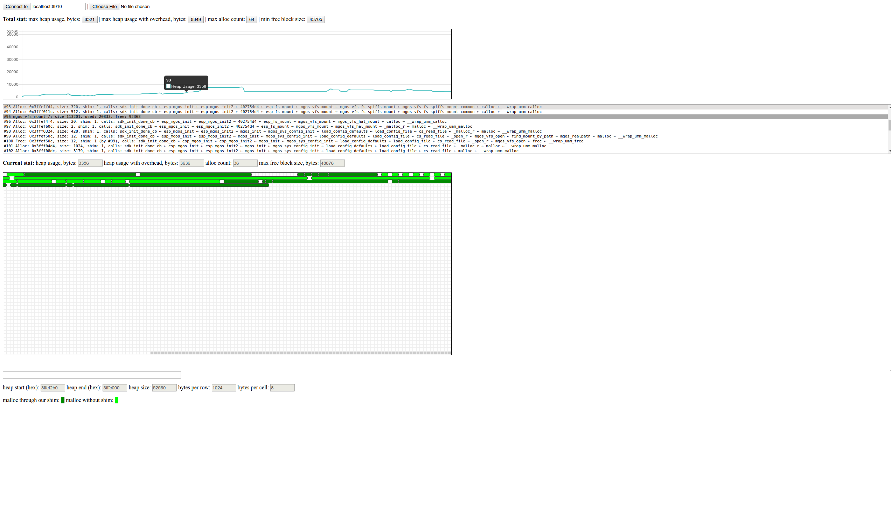

# Debugging tools

Mongoose OS provides several ways to debug firmware functionality. They
are listed below in the order of complexity.

## Increase debug log level

There is a top-level `debug` section in the configuration. It could be
inspected by clicking on a "Device config" tab in the GUI, or through the
command line:

<pre class="command-line language-bash" data-user="chris" data-host="localhost" data-output="2-100"><code>mos config-get debug
{
  "factory_reset_gpio": -1,
  "level": 2,
  "mbedtls_level": 0,
  "mg_mgr_hexdump_file": "",
  "stderr_topic": "esp8266_067082/log",
  "stderr_uart": 0,
  "stdout_topic": "esp8266_067082/log",
  "stdout_uart": 0,
  "udp_log_addr": ""
}</code></pre>

The default level is 2. Level -1 means no log. Level 0 is `ERROR`, 1 is `WARN`,
2 is `INFO`, 3 is `DEBUG`, 4 is `VERBOSE_DEBUG`. Level 4 means log everything
possible, it is very verbose. Start with increasing to level 3.

#### Increasing the debug level from the command line

<pre class="command-line language-bash" data-user="chris" data-host="localhost" data-output="2-100"><code>mos config-set debug.level=3
Getting configuration...
Setting new configuration...
Saving and rebooting...</code></pre>

#### Increasing the debug level from the UI



That will reboot the device, and it will start logging with the increased
verbosity.

### Debug configuration settings quick reference

```javascript
{
  "factory_reset_gpio": -1,   // Used to reset the device. Hold this pin down and reboot to reset
  "filter": "mg_,*mqtt*",     // Log filter. Prefix match glob for source file or function name
  "level": 2,                 // Log verbosity level
  "mbedtls_level": 0,         // Log verbosity level for TLS library
  "mg_mgr_hexdump_file": "",  // Set to "-" to hexdump network packets
  "stderr_topic": "",         // If set, an MQTT topic to send stderr logs to
  "stderr_uart": 0,           // UART number for stderr logs
  "stdout_topic": "",         // If set, an MQTT topic to send stdout logs to
  "stdout_uart": 0,           // UART number for stdout logs
  "udp_log_addr": ""          // Set to "IP_ADDR:PORT" to send logs to this UDP address
}
```

Notes:
- `mos` tool starts a UDP listener on port 1993. Therefore, if you set
  `debug.udp_log_addr` to `YOUR_MACHINE_IP:1993`, `mos` tool will start showing
  your device logs.
- If you connect to your device using via Websocket, as `ws://IP_ADDR/rpc`,
  then `mos` tool automatically sets the `debug.udp_log_addr` to the correct
  value and you don't need to set it up manually.

## Analysing core dumps

If your app crashes showing a core dump message, you can start GDB against
that coredump and analyse the backtrace at the time of the crash, as well
as the state of the firmware.

First, save the coredump data to the `console.log` file.
Then clone the `mongoose-os` repo:
<pre class="command-line language-bash" data-user="chris" data-host="localhost" data-output="100"><code>git clone https://github.com/cesanta/mongoose-os</code></pre>

Then from your apps' directory, do
<pre class="command-line language-bash" data-user="chris" data-host="localhost" data-output="2-20"><code>make -C PATH_TO_MONGOOSE_OS_REPO/fw/platforms/esp8266 debug_coredump \
  CONSOLE_LOG=$(pwd)/console.log ELF_FILE=$(ls $PWD/build/objs/fw.elf)</code></pre>

## Running a heap log analyser

Heap log analyser is a tool developed by the Mongoose OS team. It is used
for detecting memory leaks, and does it in a visual way, allowing to
quickly pinpoint the place where a leak is happening. In order to use
the heap log viewer, follow the steps below:

### Enable heap log tracing

Edit your app's `mos.yml`, add the following section:

```yaml
build_vars:
  MGOS_ENABLE_HEAP_LOG: 1
  MGOS_ENABLE_CALL_TRACE: 1
```

Rebuild your app:

<pre class="command-line language-bash" data-user="chris" data-host="localhost" data-output="2-100"><code>mos build --clean --arch esp8266
...</code></pre>

### Run your app to collect the heap log

Your console log will become very noisy lots of `hl{...}` lines.
Run your app, let it run a few cycles, and save the log somewhere.
If you're on Mac/linux,
<pre class="command-line language-bash" data-user="chris" data-host="localhost" data-output="2-100"><code>mos console | tee /tmp/console.log | grep -av 'hl{'</code></pre>
This way you don't see the noise, but it's all logged in `/tmp/console.log`.

### Analyse logs

Clone `mongoose-os` repo and start heap log viewer tool:

<pre class="command-line language-bash" data-user="chris" data-host="localhost" data-output="100"><code>git clone https://github.com/cesanta/mongoose-os
cd mongoose-os/tools/heaplog_viewer/heaplog_server
go build
./heaplog_server --logtostderr --document_root .. \
  --binary=YOUR_APP_PATH/build/objs/fw.elf --console_log /tmp/console.log</code></pre>

Point your browser at http://localhost:8910/ and press "connect".
This should give you a pretty picture like this:


