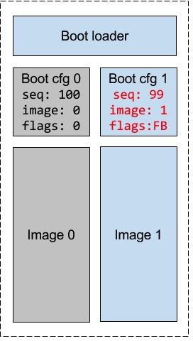

# OTA - Over The Air firmware update

The OTA in Mongoose OS could be done via different mechanisms,
summarized by the following table:

| Trigger method  | Download method |  Libraries required  |  Notes | Example |
| --------------- | --------------- | -------------------- | ------ | ------- |
| HTTP POST  | HTTP/HTTPS push | [ota-http-server](https://github.com/mongoose-os-libs/ota-http-server) | This is a direct HTTP push. Suitable during development or for automatic tests, but not for production. No restrictions. | <tt>curl -v -i -F filedata=@fw.zip  http://IPADDR/update</tt> |
| `OTA.Update` RPC command | HTTP/HTTPS pull | [rpc-service-ota](https://github.com/mongoose-os-libs/rpc-service-ota), [ota-http-client](https://github.com/mongoose-os-libs/ota-http-client) | The RPC command could be given locally or remotely via [multiple ways](/docs/book/rpc.html). The download is done by the `ota-http-client` library, which is restricted: free version can download only from the `dash.mongoose-os.com`. Paid version have no restriction. | <tt>mos call OTA.Update '{"url": "http://foo.com/fw.zip"}'</tt> |
| Automatic periodic URL poll | HTTP/HTTPS pull | [ota-http-client](https://github.com/mongoose-os-libs/ota-http-client) | Free version is restricted - see above. | See [configuration section](https://github.com/mongoose-os-libs/ota-http-client/blob/master/mos.yml#L11-L13)|
| Shadow update  | HTTP/HTTPS pull | [ota-shadow](https://github.com/mongoose-os-libs/ota-shadow), [aws](https://github.com/mongoose-os-libs/aws), [ota-http-client](https://github.com/mongoose-os-libs/ota-http-client) | Update is triggered by the device shadow object. Download is done by the `ota-http-client`, which is restricted - see above. | See [example](https://github.com/mongoose-os-libs/ota-shadow) |
| Shadow update  | dashboard pull | [ota-shadow](https://github.com/mongoose-os-libs/ota-shadow), [dash](https://github.com/mongoose-os-libs/dash) | Most RAM-efficient method, causes uses an existing dashboard connection for the download. Most safe method, as the device side pulls chunk by chunk, thus shaping the traffic with little chances to crash out-of-memory. No restricition with regard to URL. | See [example](https://github.com/mongoose-os-libs/ota-shadow)  |
| Custom firmware code  | any | none | Mongoose OS OTA API allows to create OTA context, then feed it chunk by chunk with the contents of the firmware zip file. Firmware transfer method could anything - over serial connection, bluetooth, etc. | n/a |


# Implementation details

The main design principle of the OTA mechanims is reliability: never end up with
a bricked device, roll back on any failure. Therefore, an OTA process never
updates firmware code or data in-place. Any failure (e.g. power
loss) can end up in broken device. Thus, an OTA mechanism uses independent
self-contained flash paritions to hold firmware images (code and data), and
an intelligent boot loader makes a decision which partition to boot:


Here is a high level overview of the OTA procedure:

1. OTA is triggered via one of the many supported methods:
   HTTP POST request,
   [periodic timer that polls well known location](https://github.com/mongoose-os-libs/ota-http-client),
   [AWS IoT device shadow change](https://github.com/mongoose-os-libs/ota-aws-shadow),
   an [`OTA.Update` RPC command](https://github.com/mongoose-os-libs/rpc-service-ota), or other.
   You can create your method using an [OTA API](/docs/api/mgos_updater.h.html).
2. A separate flash partition is created to hold a new firmware image - code
   and data (root filesystem).
3. A new firmware image is downloaded to the new flash partition. Any failure
   during that process aborts an OTA.
4. When new firmware image is successfully copied,
  - All files from the old FS that do not exist in the new FS, are
    moved to the new FS. This is an important mechanism of preserving user
    data and device-specific configuration, like `conf2.json` - `conf9.json`
    configuration files, or any other files. Remember: if a firmware image
    contains a file, it'll override an existing file during OTA.
    Never put files like `conf9.json` in your firmware.
  - Boot loader configuration is updated, saying that a new partition exists
    and the boot loader must boot from it. A new partition is marked dirty,
    and the "commit interval" time is stored in the boot configuration.
5. Device reboots. Boot loader boots the new partition. It figures out from
   the boot configuration that that partition is dirty, unsafe, because the
   "commit" flag is not set. Therefore it starts the hardware timer that will
   fire after the "commit interval", and executes the new image.
6. The new image start, performs a usual boot sequence. At some point
   a `mgos_upd_commit()` is called, which sets a "commit" flag in the
   boot config, marking this firmware "OK". A commit call could be done
   automatically after the health-checks, or manually by the user.
   If the commit is not made, a boot config still has "commit" flag not set.
7. A boot loader timer handler kicks in. It checks the commit flag. If it is set,
   it silently exits. If not set, i.e. the firmware is still dirty, the
   rollback is performed: the image to boot, and commit flag are
   set to their previous values, and device reboots.

The in-depth example of the OTA on CC3200 is given at
[embedded.com article - Updating firmware reliably](https://www.embedded.com/design/prototyping-and-development/4443082/Updating-firmware-reliably)

## OTA using HTTP POST

This is the simplest method, very useful for development. Of course it works
only if the device is directly visible. In order to enable HTTP POST OTA
handler, include [ota-http-server](https://github.com/mongoose-os-libs/ota-http-server)
library in your `mos.yml`. Then, you
can build a new firmware and push it using this command:

```
curl -v -F file=@build/fw.zip -F commit_timeout=60 http://IP_ADDR/update
```

## Boot configuration section

If the boot config is stored in only one location,
it makes it susceptible to failure during updates, which are usually performed
as a read-erase-write operation: a reboot after erase and before write is
complete could render device unbootable. The time between the two is short,
but we set out to make our update process safe at all points, so we have
to deal with it. The way we do it by using two config files with versioning,
or sequencing. A sequencer is a monotonically decreasing number, so of the
two files the one with smaller sequencer is more recent - on figure 2,
config 1 is selected as active because it has smaller sequencer.
When writing a new config file, we always use the currently inactive
(older) slot and it will not become newer until it is written - erased
config will be older than any valid one because erased NOR flash is
filled with all 1s:

