# Mongoose OS quick start quide

A 15 minute guide to turn your device into a mobile-controllable,
updatable, remotely manageable, secure, configurable product.

<div class="row">
  <div class="col-md-4">
    <div><a href="#download-and-install-mos-tool">1. Download and install</a></div>
    <div><a href="#start-mos-tool">2. Start mos tool</a></div>
    <div><a href="#usb-to-serial-drivers">3. Intall drivers (if needed)</a></div>
    <div><a href="#create-new-app">4. Create new app</a></div>
  </div>
  <div class="col-md-4">
    <div><a href="#build-app-firmware">5. Build app firmware</a></div>
    <div><a href="#flash-firmware">6. Flash firmware</a></div>
    <div><a href="#configure-wifi">7. Configure WiFi</a></div>
    <div><a href="#add-device-to-the-mdash-management-dashboard">8. Register on mDash</a></div>
  </div>
  <div class="col-md-4">
    <div><a href="#enable-mobile-app">9. Enable mobile app</a></div>
    <div><a href="#control-your-device-from-the-mobile-app">10. Control from mobile</a></div>
    <div><a href="#update-firmware-over-the-air">11. OTA update firmware</a></div>
    <div><a href="#next-steps">12. Next steps</a></div>
  </div>
</div>

## Download and install mos tool

Mongoose OS uses `mos` tool for various tasks:
building firmware, flashing firmware,
managing device, provisioning device on cloud services, and so on.

|  OS |  Setup instructions | 
| --- | ------------------- |
| Windows | Create `C:\mos` folder. Right-click on this [mos.exe](https://mongoose-os.com/downloads/mos-release/win/mos.exe) link,  choose "Save link as", save `mos.exe` into the `C:\mos` folder. Double-click on `mos.exe` to start a Web UI. |
|  MacOS | First, [install brew utility](https://brew.sh/). Then execute the following to start a Web UI: <pre>brew tap cesanta/mos<br>brew install mos<br>mos</pre> |
|  Ubuntu Linux | Note: Linux version starts UI in a browser window. <pre>sudo add-apt-repository ppa:mongoose-os/mos<br>sudo apt-get update<br>sudo apt-get install mos<br>mos</pre> |
|  Arch Linux | Note: Linux version start UI in a browser window. <pre>git clone https://github.com/cesanta/mos-tool<br>cd mos-tool/mos/archlinux_pkgbuild/mos-release<br>makepkg<br>pacman -U ./mos-*.tar.xz<br>mos</pre> |
|  Generic MacOS/Linux | Note: starts UI in a browser window. <pre>curl -fsSL https://mongoose-os.com/downloads/mos/install.sh \| /bin/bash<br>mos</pre> |

## Start mos tool

Make sure your device is connected via the USB to your workstation.

Completing previous section should leave you with the `mos` Web UI running:

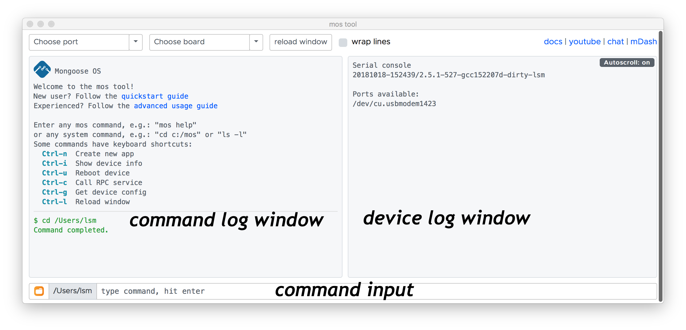

Note: if you like using command prompt / terminal instead of the UI,
you can execute `mos` commands in a command prompt instead.
The Web UI appears only when `mos` tool is started without arguments.
On Windows and Mac, closing the Web UI window also terminates the `mos` command.
On Linux, the Web UI is started in a browser, so to stop it, close the
browser window and pressing `Ctrl-C` in a terminal where `mos` is running.


## USB-to-Serial drivers

If the UI complains about the unavailable ports, and you have your device
connected, the problem could be with the USB-to-Serial driver.
Make sure you have them installed:

- [Silabs drivers](https://www.silabs.com/products/mcu/Pages/USBtoUARTBridgeVCPDrivers.aspx) for Espressif boards
- [CH43x drivers](https://github.com/adrianmihalko/ch340g-ch34g-ch34x-mac-os-x-driver) for Espressif boards
- [FTDI drivers](http://www.ftdichip.com/Drivers/VCP.htm) for CC3200, CC3220

When done, press `Ctrl-l` to refresh the window. In a port dropdown, at least
one port should be present.

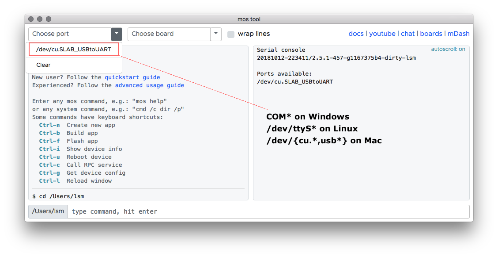

## Create new app

In the UI, select your board from the dropdown menu. Then, press `Ctrl-n`
to create a new app. That will paste the `mos clone` command into the prompt:

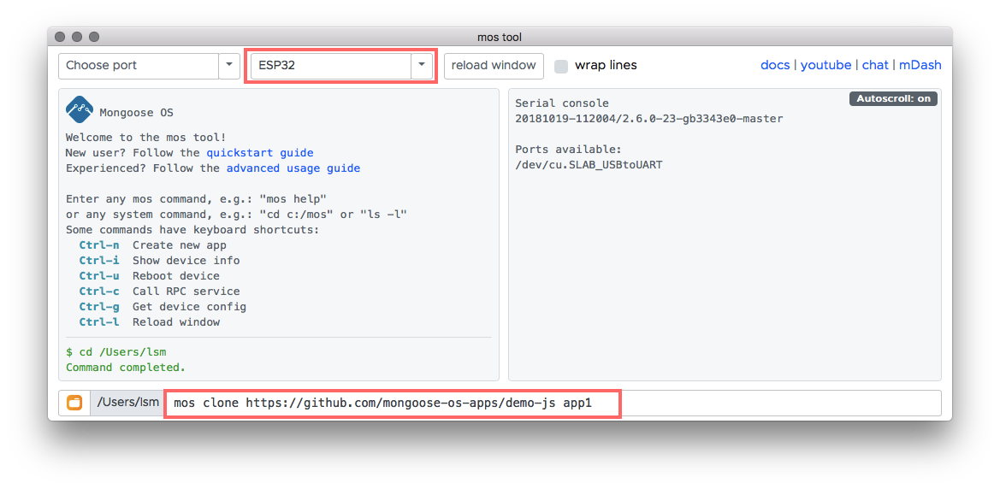

Press Enter. That will clone the
[demo-js](https://github.com/mongoose-os-apps/demo-js) repository as `app1`.
Notice how current directory has changed to `app1`:

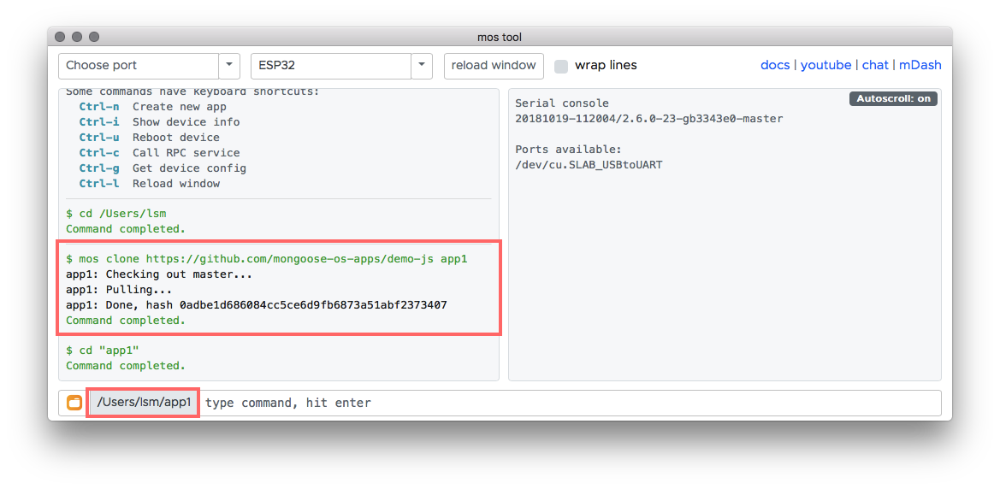


## Build app firmware

Make sure the board is selected, then press `Ctrl-b` and press enter.
That starts a build process that takes several seconds to complete:


When the command finishes, the built firmware will be located at `build/fw.zip`.
As you can see, we won't make any changes to the app - we'll do that later.

## Flash firmware

Make sure the port is selected in the dropdown menu.
Type `mos flash` and press enter. That will flash a built firmware to the device:

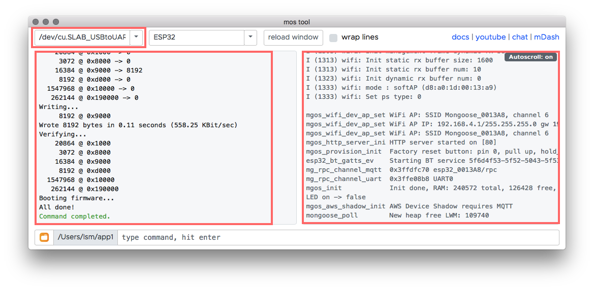

When flashing completes, the firmware starts to write logs to the serial
console. Notice how new messages start to appear in the right window.
The window autoscrolls to the bottom, unless you scroll up manually to see
some previous logs. To re-enable the scrol, click on the command input
and press enter.

## Configure WiFi

Type command `mos wifi WIFI_NETWORK_NAME WIFI_PASSWORD`. Use your own
network name/password. Press enter. On the serial console, you'll see how
the device reboots after saving new configuration settings, joins the WiFi
network, gets the IP configuration, and synchronises time with SNTP server:

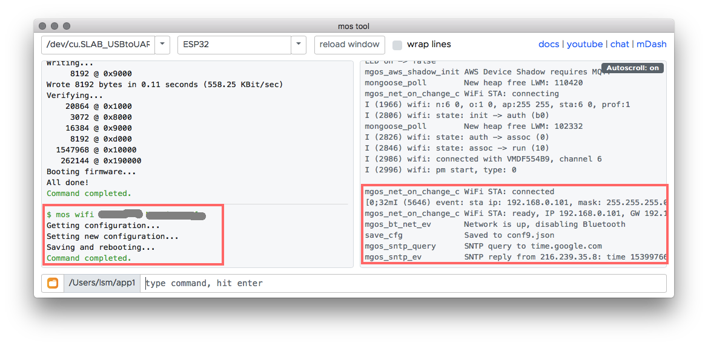


## Add device to the mDash management dashboard

- Login to the mDash at https://dash.mongoose-os.com/. 
- Click on "Add new device" button. That'll create a new device.
- Click on a "Token" link to copy the device's access token to the clipboard:

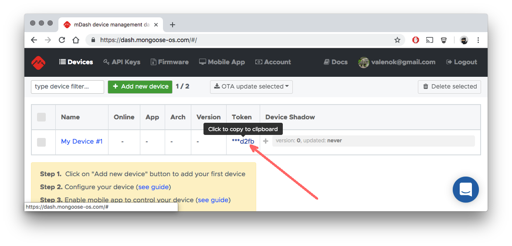

- Go back to the mos tool, type command (change ACCESS_TOKEN to your copied
access token) and press enter:
  ```
  mos config-set dash.enable=true dash.token=ACCESS_TOKEN
  ```


Notice that the device started to print messages `{"uptime":XX,"on":false}`
to the serial console. It sends this message to the dashboard, reporting
its state to the device shadow
([read more about device shadows](../mdash/shadow.md)).

Notice that the device became online on mDash, and how the device shadow
updates every second, incrementing its version number:

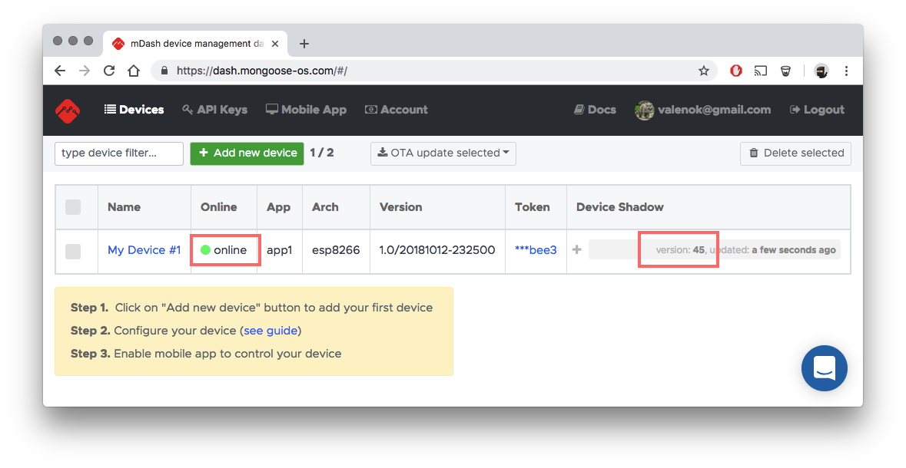


Click on the "+" sign to expand the shadow. Scroll it down and see how
the reported "uptime" metric updates every second. "Uptime" is the amount
of time since the last power-on or reboot:

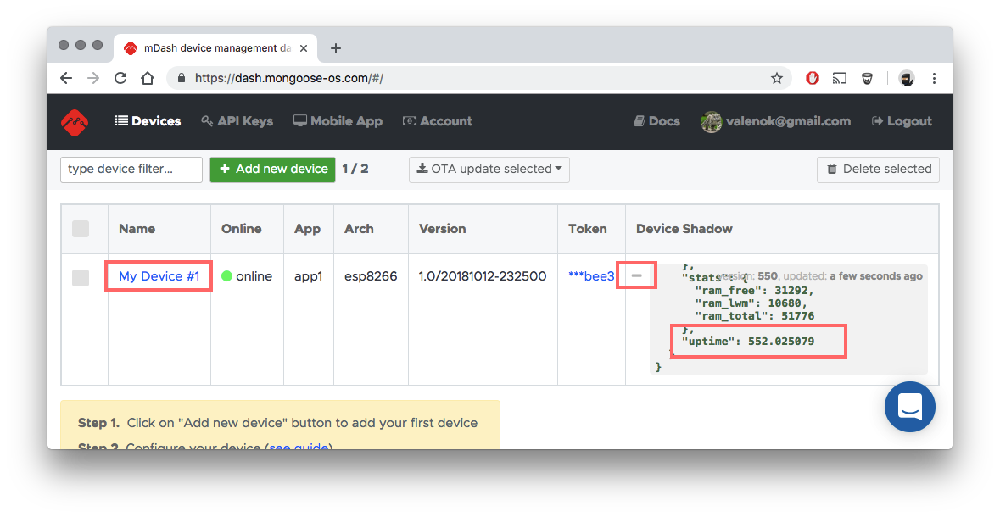

Click on a device name to see a detailed management console for the device:
general information, real-time notifications, configuration editor, file
editor, device shadow editor, and an RPC service call window. We won't study
all these management tools now though, so proceed to the next step.

## Enable mobile app

Click on the "Mobile app" menu, and click on a checkbox to enable mobile app.
Enter your email address in the text box and press on "Send invitation" button:

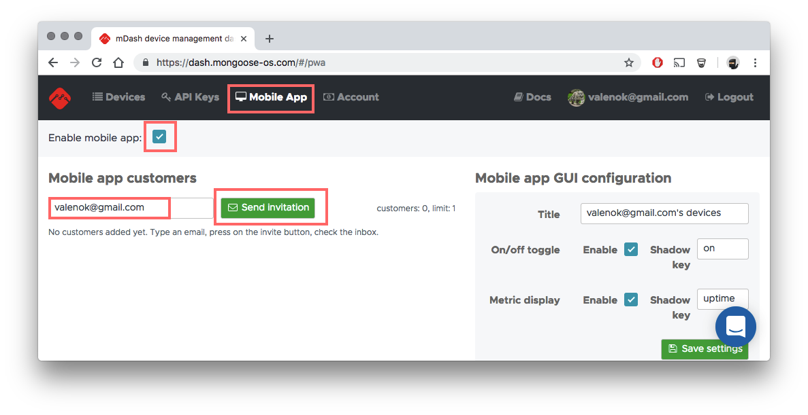

On your mobile phone, open you inbox, open an email from mDash:

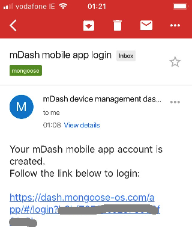


## Control your device from the mobile app

Click on the link in the invitation email. This will bring you immediately
to the PWA (Progressive Web App). It is available only for those who has
the link, because the app access token is embedded inside the link.

Notice how the reported device state is displayed on the mobile app.
An `uptime` metric is displayed as a read-only value. An `on` value,
however, is rendered as a toggle button:

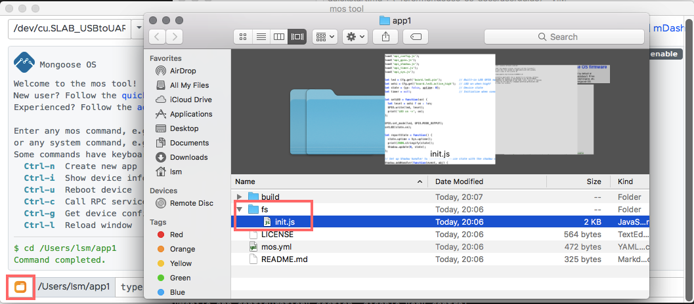

Pressing the button turns is on, changes the device shadow key `on` from `false`
to `true`, and lights on an LED on a device:

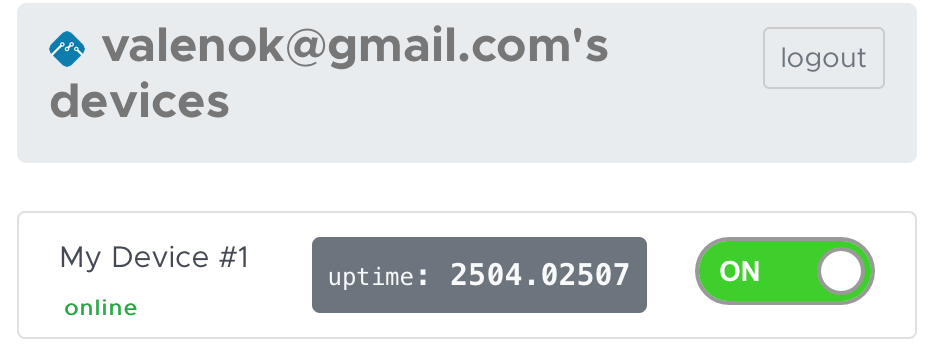


## Update firmware over-the-air

Now let's update our device with the new firmware over the air.
First, rebuild the firmware by pressing `Ctrl-b` followed by Enter.
That will create a firmware .zip file with the new build timestamp.

Go to the mDash, click on "Devices" top menu item to see the device list.
Select a device, click on "OTA update selected" button, then click on
"Choose firmware .zip file":


Navigate to the freshly built `fw.zip` file, then notice how the
progress bar appears showing the OTA progress:

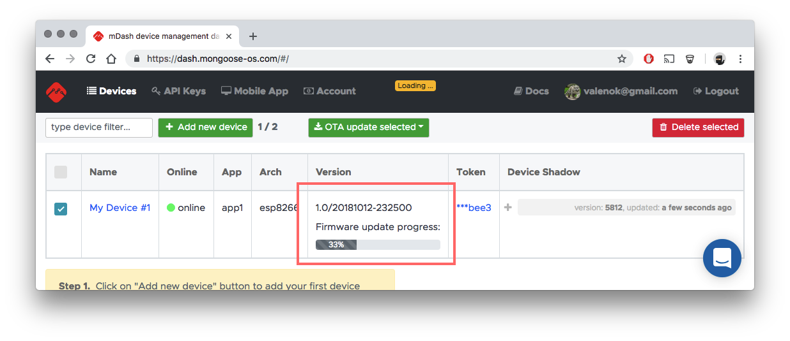

When OTA finishes, click on "Mobile App" menu item. In the
"Mobile app configuration" section, disable "on" control,
change "uptime" to "temp" and save:

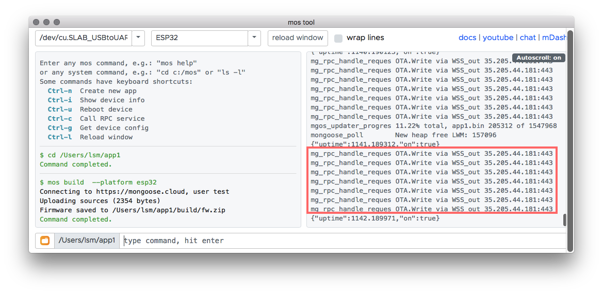

Go to your mobile app and notice how the UI changes. On/off control
disappeared, and instead of uptime, we're showing a temperature in a
20-23 range:

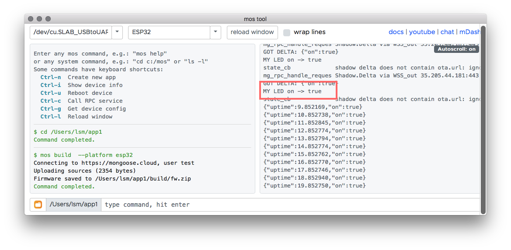

## Next steps

It's time to move on to more advanced topics - learn how to add support
to different hardware peripherals, write logic in both C/C++ and JS,
use API reference, send data to the databases/analytics engines like
Firebase. Proceed to the [advanced guide](advanced-c.md).
